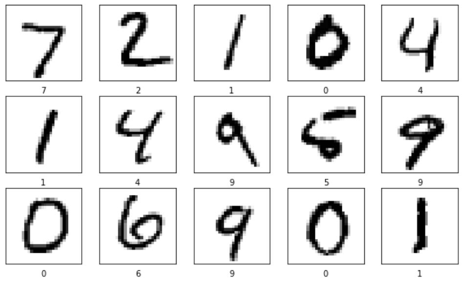
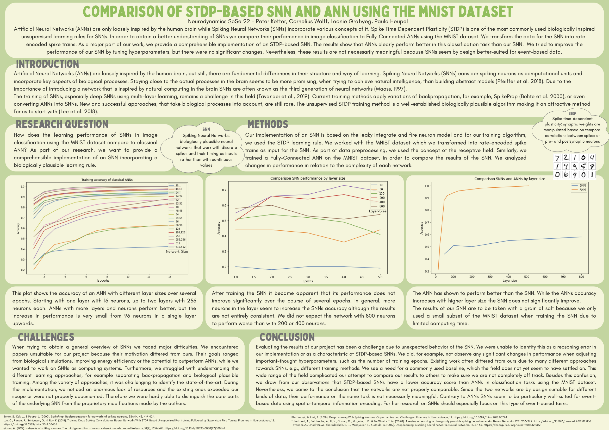
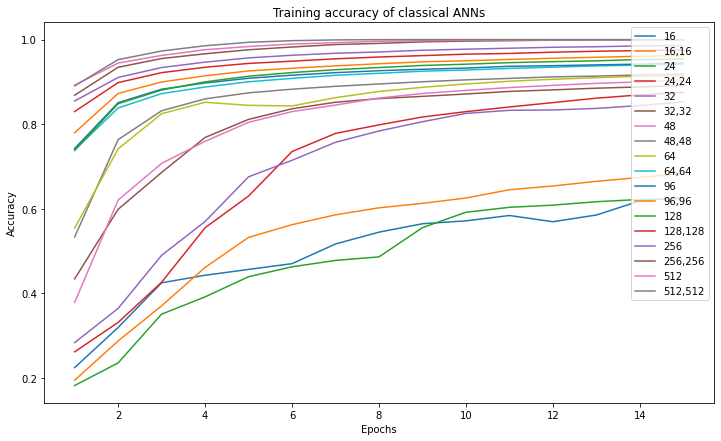
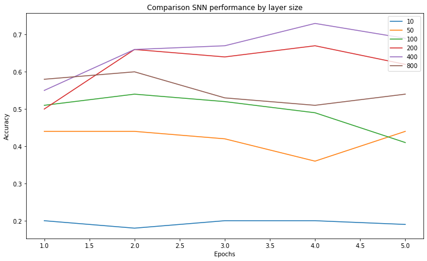

# A simple Implementation of an SNN - Report and Implementation

## Spiking Neural Networks with STDP

This report and implementation showcase a comprehensive study of Spiking-Neural-Networks (SNNs) with Spike-Timing-Dependent Plasticity (STDP). The project includes detailed analysis, experimental results, and a fully functional implementation from scratch in Python.

<p align="right">(<a href="#top">back to top</a>)</p>

## 📖 Table of Contents

- [❓ Why?](#-why)
- [✨ Features](#-features)
- [💻 Usage](#-usage)
- [💾 Structure](#-structure)
- [🚫 Limitations](#-limitations)
- [📊 Poster](#-poster)
- [📋 Report](#-report)
- [📝 Author](#-author)
- [📊 Dataset Attribution](#-dataset-attribution)
- [📎 License](#-license)
<p align="right">(<a href="#top">back to top</a>)</p>

## ❓ Why?

Artificial Neural Networks (ANNs) are only loosely inspired by the human brain while Spiking Neural Networks (SNNs) incorporate various concepts of it.
Spike Time Dependent Plasticity (STDP) is one of the most commonly used biologically inspired unsupervised learning rules for SNNs.<br/>
In order to obtain a better understanding of SNNs we compared their performance in image classification to Fully-Connected ANNs using the MNIST dataset. <br/>
 <br/>
For this to work, we had to transform the data for the SNN into rate-encoded spike trains.
As a major part of our work, we provide a comprehensible implementation of an STDP-based SNN.

<p align="right">(<a href="#top">back to top</a>)</p>

## ✨ Features

With the files we provided you can either train your own Spiking-Neural-Network or do inference on existing pretrained weights. For training you can either use the dataset we uploaded in the MNIST folder and subfolders or you can simply use the MNIST dataset provided by tensorflow. Therefore in the [SNN.py](SNN.py) file you can find examples for both, how to convert your own image data into spike trains and how to transform an existing tensorflow dataset into spike trains.<br/>

<p align="right">(<a href="#top">back to top</a>)</p>

## 💻 Usage

To use our code, you first have to install the requiered libraries from the requirements.txt.

```
 pip install -r requirements.txt
```

After this, you can train your own SNN.

```
 python3 main.py -mode training -use_tf_dataset
```

You can also use this script to test your own trained network and weights.

```
 python3 main.py -mode inference -weights_path folder/weights.csv -labels_path folder/labels.csv -image_inference_path folder/picture.png
```

To get a list of all possible hyperparameters use

```
 python3 main.py -h
```

<p align="right">(<a href="#top">back to top</a>)</p>

## 💾 Structure

<!-- Project Structure -->

    .
    ├── src
    │   ├── MNIST                              # Here is the entire MNIST dataset
    │   │   ├── testing
    │   │   │   ├── 0                          # Each subfolder represents a class
    │   │   │   │   ├── 3.png
    │   │   │   │   ├── 10.png
    │   │   │   │   ├── 13.png
    │   │   │   │   ...
    │   │   │   ├── 1
    │   │   │   ├── 2
    │   │   │   ├── 3
    │   │   │   ├── 4
    │   │   │   ├── 5
    │   │   │   ├── 6
    │   │   │   ├── 7
    │   │   │   ├── 8
    │   │   │   ├── 9
    │   │   ├── training
    │   │   │   ├── 0
    │   │   │   ...
    │   │   ├── labels.csv
    ├── Notebooks
    │   │── ANN_Comparison.ipynb          # Comparison ANNs being trained in Tensorflow
    │   │── Visualization_Helper.ipynb    # Visualization of our results
    │   │── Deprecated_Training.ipynb     # Old deprecated training notebook
    ├── Pretrained              # Pretrained weights and labels for testing
    │   │── labels.csv
    │   │── weights.csv
    │── .gitignore
    │── main.py                 # Main file for executing training/inference the SNN
    │── Neuron.py
    │── Paper.pdf               # The term paper we submitted
    │── Parameters.py           # All parameters used for training/inference
    │── README.md
    │── requirements.txt
    └── SNN.py                  # The file containing all functions for training/infering

<p align="right">(<a href="#top">back to top</a>)</p>

## 🚫 Limitations

- No hidden layers implemented
- Conversions into Spike Trains works only with GreyScale
- Long training times
- Didn't use the entire MNIST dataset for training
<p align="right">(<a href="#top">back to top</a>)</p>

## 📊 Poster

As part of this lecture, we also provided a poster presentation of our results for our fellow students and lecturers.

<p align="center"></p> <br /> 
<p align="right">(<a href="#top">back to top</a>)</p>

## 📋 Report

For more details on the implementation, hyperparameters, and comprehensive analysis, please refer to the [accompanying report](report.pdf). Here are some of our key results:<br/>
 |<br/>
The SNN implementation achieved good classification performance after only one epoch of training. However, performance improvements plateaued thereafter and the model was outperformed by classical ANNs with Dense layers after a few epochs. Additionally, the SNNs showed diminishing returns with increased neuron counts compared to classical ANNs.

<p align="right">(<a href="#top">back to top</a>)</p>

## 📝 Author

**de larbi mohammed achraf**

<p align="right">(<a href="#top">back to top</a>)</p>

## 📊 Dataset Attribution

The MNIST dataset used in this project is sourced from [Kaggle](https://www.kaggle.com/datasets/). We thank the Kaggle community for providing access to this valuable dataset.

<p align="right">(<a href="#top">back to top</a>)</p>

## 📎 License

Copyright © 2025 de larbi mohammed achraf

Licensed under the Apache License, Version 2.0 (the "License");
you may not use this file except in compliance with the License.
You may obtain a copy of the License at

    http://www.apache.org/licenses/LICENSE-2.0

Unless required by applicable law or agreed to in writing, software
distributed under the License is distributed on an "AS IS" BASIS,
WITHOUT WARRANTIES OR CONDITIONS OF ANY KIND, either express or implied.
See the License for the specific language governing permissions and
limitations under the License.

<p align="right">(<a href="#top">back to top</a>)</p>
